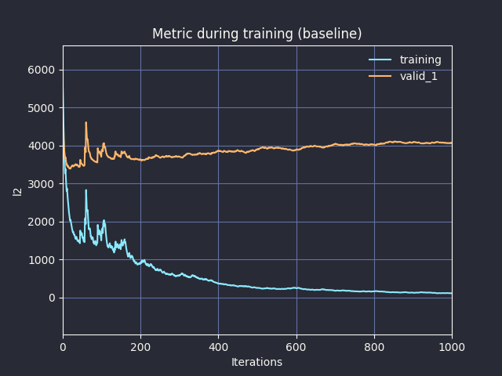
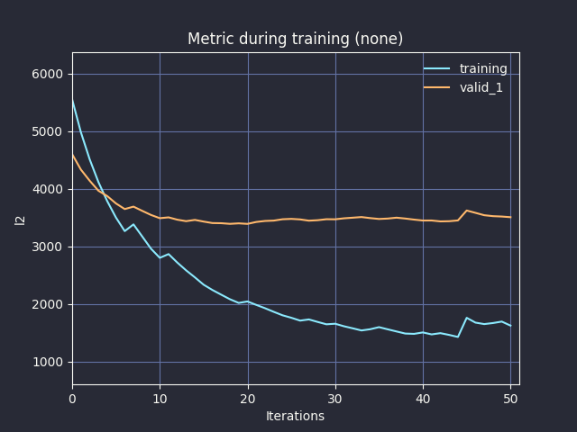
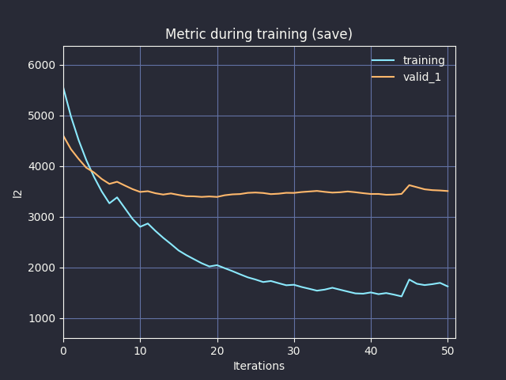
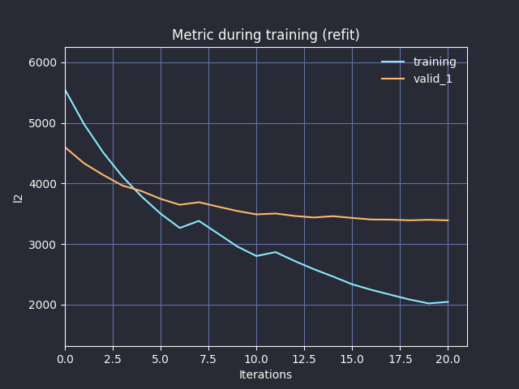

# LightGBM Callbacks

<p align="center">
  <a href="https://github.com/34j/lightgbm-callbacks/actions/workflows/ci.yml?query=branch%3Amain">
    
  </a>
  <a href="https://lightgbm-callbacks.readthedocs.io">
    
  </a>
  <a href="https://codecov.io/gh/34j/lightgbm-callbacks">
    
  </a>
</p>
<p align="center">
  <a href="https://python-poetry.org/">
    
  </a>
  <a href="https://github.com/ambv/black">
    
  </a>
  <a href="https://github.com/pre-commit/pre-commit">
    
  </a>
</p>
<p align="center">
  <a href="https://pypi.org/project/lightgbm-callbacks/">
    
  </a>
  
  
</p>

A collection of [LightGBM](https://github.com/microsoft/LightGBM) [callbacks](https://lightgbm.readthedocs.io/en/latest/Python-API.html#callbacks).
Provides implementations of `ProgressBarCallback` ([#5867](https://github.com/microsoft/LightGBM/pull/5867)) and `DartEarlyStoppingCallback` ([#4805](https://github.com/microsoft/LightGBM/issues/4805)), as well as an `LGBMDartEarlyStoppingEstimator` that automatically passes these callbacks. ([#3313](https://github.com/microsoft/LightGBM/issues/3313), [#5808](https://github.com/microsoft/LightGBM/pull/5808))

## Installation

Install this via pip (or your favourite package manager):

```shell
pip install lightgbm-callbacks
```

## Usage

### SciKit-Learn API, simple

```python
from lightgbm import LGBMRegressor
from lightgbm_callbacks import LGBMDartEarlyStoppingEstimator
from sklearn.datasets import load_diabetes
from sklearn.model_selection import train_test_split

X, y = load_diabetes(return_X_y=True)
X_train, X_test, y_train, y_test = train_test_split(X, y)
LGBMDartEarlyStoppingEstimator(
    LGBMRegressor(boosting_type="dart"), # or "gbdt", ...
    stopping_rounds=10, # or n_iter_no_change=10
    test_size=0.2, # or validation_fraction=0.2
    shuffle=False,
    tqdm_cls="rich", # "auto", "autonotebook", ...
).fit(X_train, y_train)
```

### Scikit-Learn API, manually passing callbacks

```python
from lightgbm import LGBMRegressor
from lightgbm_callbacks import ProgressBarCallback, DartEarlyStoppingCallback
from sklearn.datasets import load_diabetes
from sklearn.model_selection import train_test_split

X, y = load_diabetes(return_X_y=True)
X_train, X_test, y_train, y_test = train_test_split(X, y)
X_train, X_val, y_train, y_val = train_test_split(X_train, y_train)
early_stopping_callback = DartEarlyStoppingCallback(stopping_rounds=10)
LGBMRegressor(
).fit(
    X_train,
    y_train,
    eval_set=[(X_train, y_train), (X_val, y_val)],
    callbacks=[
        early_stopping_callback,
        ProgressBarCallback(early_stopping_callback=early_stopping_callback),
    ],
)
```

### Details on `DartEarlyStoppingCallback`

Below is a description of the `DartEarlyStoppingCallback` `method` parameter and `lgb.plot_metric` for each `lgb.LGBMRegressor(boosting_type="dart", n_estimators=1000)` trained with entire `sklearn_datasets.load_diabetes()` dataset.

| Method     | Description                                                                                  | iteration                                                   | Image                                 | Actual iteration |
| ---------- | -------------------------------------------------------------------------------------------- | ----------------------------------------------------------- | ------------------------------------- | ---------------- |
| (Baseline) | If Early stopping is not used.                                                               | `n_estimators`                                              |  | 1000             |
| `"none"`   | Do nothing and return the original estimator.                                                | `min(best_iteration + early_stopping_rounds, n_estimators)` |      | 50               |
| `"save"`   | Save the best model by deepcopying the estimator and return the best model (using `pickle`). | `min(best_iteration + 1, n_estimators)`                     |      | 21               |
| `"refit"`  | Refit the estimator with the best iteration and return the refitted estimator.               | `min(best_iteration, n_estimators)`                         |     | 20               |

## Contributors ✨

Thanks goes to these wonderful people ([emoji key](https://allcontributors.org/docs/en/emoji-key)):

<!-- prettier-ignore-start -->
<!-- ALL-CONTRIBUTORS-LIST:START - Do not remove or modify this section -->
<!-- prettier-ignore-start -->
<!-- markdownlint-disable -->
<table>
  <tbody>
    <tr>
      <td align="center" valign="top" width="14.28%"><a href="https://github.com/34j"><br /><sub><b>34j</b></sub></a><br /><a href="https://github.com/34j/lightgbm-callbacks/commits?author=34j" title="Code">💻</a> <a href="#ideas-34j" title="Ideas, Planning, & Feedback">🤔</a> <a href="https://github.com/34j/lightgbm-callbacks/commits?author=34j" title="Documentation">📖</a></td>
    </tr>
  </tbody>
</table>

<!-- markdownlint-restore -->
<!-- prettier-ignore-end -->

<!-- ALL-CONTRIBUTORS-LIST:END -->
<!-- prettier-ignore-end -->

This project follows the [all-contributors](https://github.com/all-contributors/all-contributors) specification. Contributions of any kind welcome!
